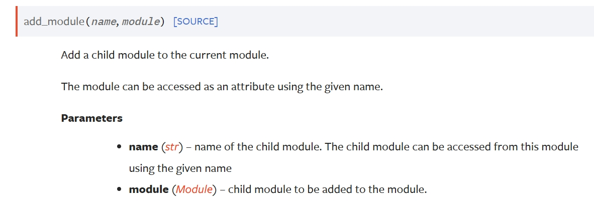

# model的使用及修改

> 在PyTorch中，网络模型的使用和修改是深度学习任务中的核心操作。

### 一、模型加载与初始化

#### 1. 加载预训练模型
```python
import torchvision.models as models

# 加载预训练ResNet-18（自动下载权重）
model = models.resnet18(pretrained=True)

# 仅加载模型结构（不加载权重）
model = models.resnet18(pretrained=False)
```

#### 2. 自定义初始化
```python
def init_weights(m):
    if isinstance(m, nn.Conv2d):
        nn.init.kaiming_normal_(m.weight, mode='fan_out')
        if m.bias is not None:
            nn.init.constant_(m.bias, 0)
    elif isinstance(m, nn.Linear):
        nn.init.normal_(m.weight, 0, 0.01)
        nn.init.constant_(m.bias, 0)

model.apply(init_weights)  # 递归应用初始化函数
```

---

### 二、模型结构修改
#### 1. 修改输出层（分类任务适配）
```python
num_classes = 10  # 新任务类别数

# 方案1：直接替换全连接层
model.fc = nn.Linear(model.fc.in_features, num_classes)

# 方案2：构建多层分类头
model.fc = nn.Sequential(
    nn.Linear(model.fc.in_features, 512),
    nn.ReLU(),
    nn.Dropout(0.5),
    nn.Linear(512, num_classes)
)
```

#### 2. 修改中间层（特征提取调整）
```python
# 替换第四个卷积块
model.layer3 = nn.Sequential(
    nn.Conv2d(256, 512, kernel_size=3, padding=1),
    nn.BatchNorm2d(512),
    nn.ReLU(inplace=True),
    nn.MaxPool2d(2)
)
```

#### 3. 添加新模块
```python
class CustomBlock(nn.Module):
    def __init__(self, in_ch):
        super().__init__()
        self.conv = nn.Conv2d(in_ch, in_ch*2, 3, padding=1)
        self.attn = nn.Sequential(
            nn.AdaptiveAvgPool2d(1),
            nn.Conv2d(in_ch*2, in_ch//2, 1),
            nn.ReLU(),
            nn.Conv2d(in_ch//2, in_ch*2, 1),
            nn.Sigmoid()
        )
    
    def forward(self, x):
        x = self.conv(x)
        return x * self.attn(x)

# 插入到原模型的layer2之后
model.layer2.add_module("attention", CustomBlock(128))
```

---



### 三、参数管理策略

#### 1. 冻结特定层（迁移学习）
```python
# 冻结所有卷积层
for param in model.parameters():
    param.requires_grad = False

# 仅解冻全连接层
for param in model.fc.parameters():
    param.requires_grad = True

# 查看可训练参数
trainable_params = sum(p.numel() for p in model.parameters() if p.requires_grad)
print(f"Trainable parameters: {trainable_params}")
```

#### 2. 分层设置超参数
```python
optimizer = torch.optim.SGD([
    {'params': model.conv1.parameters(), 'lr': 1e-4},  # 底层小学习率
    {'params': model.layer1.parameters()},             # 默认学习率1e-3
    {'params': model.fc.parameters(), 'lr': 1e-2}      # 顶层大学习率
], momentum=0.9)
```

---

### 四、模型调试与可视化
#### 1. 结构可视化
```python
print(model)  # 打印层级结构

# 使用torchviz生成计算图
from torchviz import make_dot
x = torch.randn(1,3,224,224)
dot = make_dot(model(x), params=dict(model.named_parameters()))
dot.render("model_graph", format="png")
```

#### 2. 特征图可视化
```python
# 注册前向钩子
activation = {}
def get_activation(name):
    def hook(model, input, output):
        activation[name] = output.detach()
    return hook

model.layer2[0].conv1.register_forward_hook(get_activation('layer2_conv'))

# 前向传播后查看特征图
output = model(test_input)
plt.imshow(activation['layer2_conv'][0, 0].cpu().numpy())
```

---

### 五、进阶修改技巧
#### 1. 动态网络结构
```python
class DynamicNet(nn.Module):
    def __init__(self):
        super().__init__()
        self.blocks = nn.ModuleList([
            nn.Linear(784, 256),
            nn.Linear(256, 128)
        ])
        self.dropout_rate = 0.5
    
    def forward(self, x):
        for i, layer in enumerate(self.blocks):
            x = layer(x)
            if i != len(self.blocks)-1:
                x = F.relu(x)
                x = F.dropout(x, p=self.dropout_rate, training=self.training)
        return x
```

#### 2. 模型分治策略
```python
# 多分支处理
class MultiPathNet(nn.Module):
    def __init__(self):
        super().__init__()
        self.pathA = nn.Sequential(
            nn.Conv2d(3, 64, 3),
            nn.MaxPool2d(2)
        )
        self.pathB = nn.Sequential(
            nn.Conv2d(3, 64, 5),
            nn.AvgPool2d(2)
        )
        self.fusion = nn.Conv2d(128, 256, 1)
    
    def forward(self, x):
        x1 = self.pathA(x)
        x2 = self.pathB(x)
        return self.fusion(torch.cat([x1, x2], dim=1))
```

---

### 六、⚠常见问题解决方案
| 问题现象       | 可能原因                 | 解决方案                               |
| -------------- | ------------------------ | -------------------------------------- |
| 输出维度不匹配 | 修改结构后未调整输入尺寸 | 添加自适应池化层或调整全连接层输入维度 |
| 梯度消失       | 深层网络链式求导衰减     | 添加残差连接/使用BatchNorm             |
| 显存不足       | 模型过大或批量太大       | 使用混合精度训练/梯度累积              |
| 训练震荡       | 学习率过大或数据噪声     | 添加梯度裁剪/调整学习率策略            |

---

### 七、最佳实践建议
1. **模块化设计**：将重复结构封装为子模块（如ResBlock）
2. **版本控制**：使用`torch.save(model.state_dict())`保存检查点
3. **兼容性检查**：修改后使用`torchsummary`验证输入输出尺寸
```python
from torchsummary import summary
summary(model.cuda(), (3, 224, 224))  # 显示各层参数和尺寸
```
4. **性能分析**：使用`torch.utils.bottleneck`进行性能剖析
```bash
python -m torch.utils.bottleneck train.py
```

掌握这些技巧后，您可以：
- 快速适配现有模型到新任务
- 灵活实现论文中的改进思路
- 高效诊断和修复模型问题
- 构建复杂定制化网络结构

建议结合官方文档和模型源码深入学习：
- [PyTorch Module文档](https://pytorch.org/docs/stable/nn.html#module)
- [Torchvision模型库](https://pytorch.org/vision/stable/models.html)

### 八、示例

```
import torchvision
from torch import nn
vgg16_true=torchvision.models.vgg16(pretrained=True)
print(vgg16_true)

train_data=torchvision.datasets.CIFAR10("./dataset",train=False,
                                        transform=torchvision.transforms.ToTensor())

vgg16_true.classifier.add_module("Linear",nn.Linear(1000,10))
print(vgg16_true)
```

> [!NOTE]
>
> vgg16_true.classifier.add_module("Linear",nn.Linear(1000,10))
>
> 给现存模型添加一个线性层。

